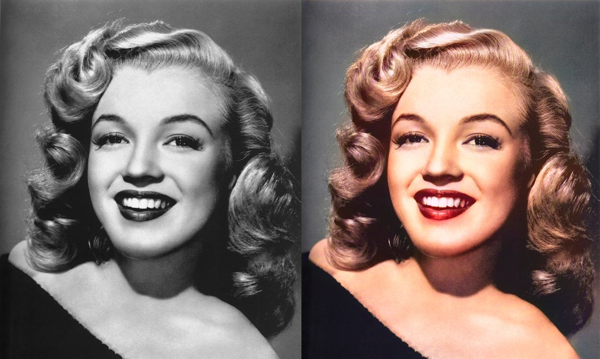

[Pix2Pix]를 활용하여 흑백 이미지를 컬러 이미지로 변환하는 튜토리얼에 오신 걸 환영합니다.  
Pix2Pix는 "Image-to-Image Translation with Conditional Adversarial Networks"에서 소개된 딥러닝 모델인데, 나온 지 오래되었지만 GAN의 역사에서 빼 놓을 수 없을 정도로 임팩트가 대단했고, 코드 또한 단순해서 GAN에 입문하는 사람들은 꼭 한번씩 읽어야만 하는 논문입니다. 이번 튜토리얼에서는 Pix2Pix를 데이터를 다운받는 것부터 시작해서, 모델 설계까지 딥러닝 개발의 모든 단계를 하나 하나 코딩할 것입니다.

우선, 코드를 돌리는데 필요한 라이브러리들을 import합니다.

대부분의 라이브러리들은 익숙하지만, skimage의 rgb2lab, lab2rgb 그리고 fastai 라이브러리는 딥러닝 개발 시에 자주 접하는 라이브러리는 아니죠. skimage 라이브러리는 이후에 설명하도록 하고, 우선 fastai 라이브러리를 import 하는 이유는 데이터셋을 쉽게 다운 받을 수 있기 때문입니다. fastai 라이브러리를 활용하여 데이터를 다운 받는 코드를 보시죠.

코드를 보면 데이터를 다운로드하는 코드는 딱 1줄로, 상당히 간편한 것을 알 수 있습니다. untar_data(URLs.COCO_SAMPLE)을 적어만 주면 데이터셋을 다운로드 후 자동으로 압축 해제까지 진행해 줍니다. 두 번째 줄은 glob 라이브러리를 사용해서 모든 이미지들의 경로를 리스트 형태로 묶어 주는데요, '/train_sample'는 이미지가 들어 있는 폴더 이름이고,  '/*.jpg'는 모든 jpg 확장자를 가진 파일들을 불러 오겠다는 의미입니다.  
이렇게 만들어진 path 변수에는 다운받은 모든 COCO 데이터셋의 이미지들에 대한 경로가 적혀지게 됩니다!  

다만, COCO_SAMPLE의 경우 이미지가 너무 많아서 훈련 시간이 너무 길어질 수 있으니, 전체 이미지 중에서 10,000장만 골라와서 사용해 봅시다!

데이터를 나누기 전, 언제나 데이터가 똑같이 나누어지도록 np.random.seed(1)을 활용하여 랜덤 시드를 설정해 줍니다. 시드 설정 후, np.random.choice(paths, 10000, replace=False) 함수를 통하여 앞서 저장한 path에 있는 모든 이미지 경로 중 10000개의 경로만 랜덤으로 선택하여 chosen_paths 변수에 저장합니다. 3번째 줄의 index의 경우, 0~9999의 수를 랜덤 순서의 리스트로 반환합니다. 예를 들면 [ 33, 5000, 9888, 0, 1, ...] 이런 식으로 말이죠.  
이렇게 생성된 chosen path와 index를 가지고 이제 train set과 validation set으로 데이터를 나누어 주어야 합니다. train_path는 chosen_paths[index[:8000]]으로 앞 8000장을 선택하고, val_path는 chosen_paths[index[8000:]]으로 설정하여 나머지 2000장을 선택하여 train set과 validation set의 비율을 8:2로 나누어 줍니다. 물론 굳이 8:2 비율을 고수하지 않으시고, 전체 데이터셋을 다 훈련에 활용하고, validation 셋은 따로 두고 사용하여도 무방합니다.  
현재까지 저희는 이미지를 다룬 게 아니라 "이미지의 경로"만 만지작거렸으니, 실제로 이미지가 잘 들어가 있는지 확인을 해 봐야겠죠? 아래의 코드를 활용하면 쉽게 이미지를 불러오고 display할 수 있습니다.

테스트 겸 train_path[0]으로 첫 번째 이미지를 불러온 다음 plt.imshow() 함수를 통해서 이미지를 display합니다. 세 번째 줄의 plt.axis('off')의 경우, 이미지를 그냥 그리게 된다면 x축과 y축에 숫자가 뜨는데, 이를 없애서 깔끔하게 이미지를 그려주는 역할을 합니다.  

이제 이미지들이 잘 들어가 있는 것을 확인하였으니, 이미지 전처리 클래스를 생성할 차례입니다. 코드를 보면서 단계별로 설명하겠습니다.

전처리 클래스는 총 세개의 함수로 나누어져 있으며, 이들은 __init__(), __getitem__(), __len__() 함수입니다.  
우선 __init__() 부터 확인해 보겠습니다. 이 함수는 mode가 train인지, validation인지 확인하여 이에 걸맞는 transform을 선언해 줍니다. 만약 train일 경우, transforms.Compose() 함수를 사용해서 이미지 크기를 256x256 사이즈로 맞추어 주고, 랜덤으로 좌우 반전 augmentation을 진행하는 변환 과정을 체이닝해 줍니다. validation의 경우 augmentation을 건너뛰고 이미지 resize만 진행합니다.  
__getitem__() 함수의 경우, index를 받아서 이미지를 불러온 다음, __init__에서 만들었던 transform에 넣어서 이미지를 변환한 이후,  skimage의 rgb2lab 라이브리를 활용해서 rgb 컬러 채널을 Lab 컬러 채널로 바꾸어 줍니다.  

만들어둔 이미지 전처리 클래스를 불러온 후, 이를 PyTorch 모델에 넣어주기 위해서 Dataloader에 인자로 넣어줍니다. 코드는 위와 같이 아주 단순합니다.

이제 Generator입니다. Pix2Pix의 Generator는 흑백 이미지를 인풋으로 받아서 컬러 정보를 아웃풋하는데, 더 정확하게는 L채널을 인풋으로 받아서 ab채널을 리턴합니다. 이를 위해서 input_layer에서의 input channel의 수는 1이고, output_layer에서의 output channel 수는 2입니다.  
모델은 U-Net 구조를 띄고 있는데, 이는 torch.cat 기능을 활용하여 skip connection이 있는 레이어에서의 feature와 직전 레이어에서의 feature를 합쳐준 후, 다음 레이어(decoder)에 전달해주는 형식으로 구현이 됩니다. 물론 코드를 outer loop, inner loop 등 각각 class를 선언하면서 짜도 되지만, 코드의 readability를 위해서 최대한 직관적으로 코드를 짜 놓았습니다.  

이제 Discriminator입니다. Discriminator의 경우, 이미지 전체 3채널을 받아서 이것이 진짜 이미지인지, 가짜 이미지인지를 판별합니다. 네트워크는 Generator에 비해서 상당히 작고 단순하다는 것을 알 수 있습니다. 보면 마지막에 활성화 함수가 들어가지 않은 것을 알 수 있는데, 이는 이후에 사용할 loss function에 활성화 함수가 포함되어있기 때문입니다.  

모델들을 선언했으니, 이제 model initialization을 진행하는 함수를 만들어 줍니다. Pix2Pix 논문에서는 모든 weight을 normal distribution에 따라 initialization을 진행하였으니, 코드도 위와 같이 단순하게 짤 수 있습니다. 물론 Conv2d와 ConvTranspose2d를 한번에 처리할 수도 있지만, 가시성을 위해서 둘의 initialization을 나누어 놓았습니다. 단순해 보이지만, initialization은 딥러닝의 학습에 있어서 엄청난 영향을 끼치므로 이가 재대로 되어있지 않다면 모델이 학습이 되지 않거나, local minima에 빠질 확률이 높아집니다.  

이제 모델도 만들었고, initialization도 완료되었으니 GAN에 활용될 Loss를 선언하겠습니다. 위의 코드를 보면 상당히 직관적이라는 것을 알 수 있는데, 받아온 이미지가 진짜 이미지라면 1.0으로 채워진 텐서를, 가짜 이미지라면 0.0으로 채워진 텐서를 생성하고, 이를 활용해서 loss를 계산할 수 있게 힙니다. Loss함수의 경우 BCEWithLogitcsLoss()를 사용합니다.  

이제 main 함수를 작성하기 전, 마지막으로 Lab채널을 RGB채널로 변환하는 함수를 작성하겠습니다. 사실 이 함수 없이도 모델을 훈련하는데에는 전혀 지장이 없지만, 그래도 훈련이 되면서 이미지가 어떻게 변하는지를 확인해보면 좋으니 중간중간에 네트워크가 얼마나 색칠을 잘하는지 확인하기 위해서 위 함수를 사용할 것입니다.  

이제 지금까지 만들어놓은 모든 함수를 모아서 훈련을 시킬 시간입니다. 코드가 꽤 길지만 생각보다 어렵진 않습니다. 일단 Generator 모델을 생성하고 initialize해준 다음 .to(device)를 사용해서 GPU에 넘겨줍니다. Discriminator도 똑같이 진행합니다. 이후 학습에 활용될 GANLoss와 L1 Loss도 선언해 주고, generator와 discriminator를 학습시킬 optimizer또한 선언해 줍니다. 이제 준비는 끝났으니, 적당한 에포크를 설정한 후 학습을 시작하겠습니다.  
현재는 빠른 학습을 위해서 에포크를 100으로 설정해 놓았읜, for문이 100번 돌아가게 됩니다. 일단 L채널과 ab채널을 dataloader로부터 뽑아온 다음, discriminator의 학습을 시작해 줍니다. Discriminator의 경우, 먼저 가짜 ab채널을 generator를 통해서 생성한 후, L채널과 합쳐서 discriminator에 가짜 이미지라는 것을 알려주면서 학습함과 동시에 진짜 ab 채널을 L채널과 합쳐서 진짜 이미지라는 것을 알려주면서 학습을 진행합니다. 이렇게 총 가짜 이미지 loss와 진짜 이미지 loss가 생길텐데, 이 둘을 더해준 다음 backward()로 역전파를 진행하고, step()으로 optimizer를 업데이트해 주면 됩니다.  
이제 Generator 학습 차례입니다. Generator가 학습하는데 Discriminator가 영향을 미치면 안되니 Discriminator의 파라미터를 모두 freeze시킨 후, 가짜 이미지를 만들어서 discriminator에게 진짜 이미지라고 거짓 정보를 전달함으로 학습을 진행합니다.  
아래의 if문은 iteration이 200의 배수일 때마다 그림을 출력하게 해 주는 코드입니다. generator를 eval(), no_grad()함수를 사용해서 잠시 학습을 중지시키고, 가짜 색을 생성하게 한 다음, 다시 train() 모드로 돌려 놓음으로 가짜 색을 생성하고 메인 함수 직전에 만들었던 Lab_to_rgb() 함수를 사용해서 rgb 채널로 변환 후 이미지를 display합니다.  
현재 코드는 train 이미지를 그대로 보여주는 코드이지만, 여기서 validation 이미지를 그리게 만든다면 모델의 성능을 더 객관적으로 확인할 수 있을 것입니다.  

여기까지 Pix2Pix로 흑백 사진을 컬러 사진으로 바꾸는 코드였습니다.
긴 글 읽어주셔서 감사합니다 :)

----
[Pix2Pix]: https://arxiv.org/pdf/1611.07004.pdf
